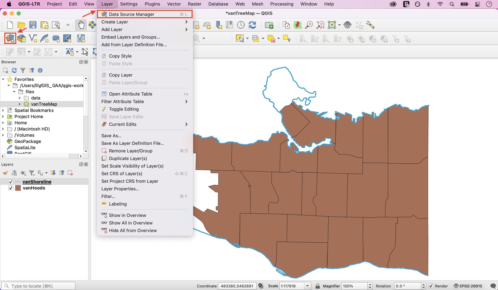
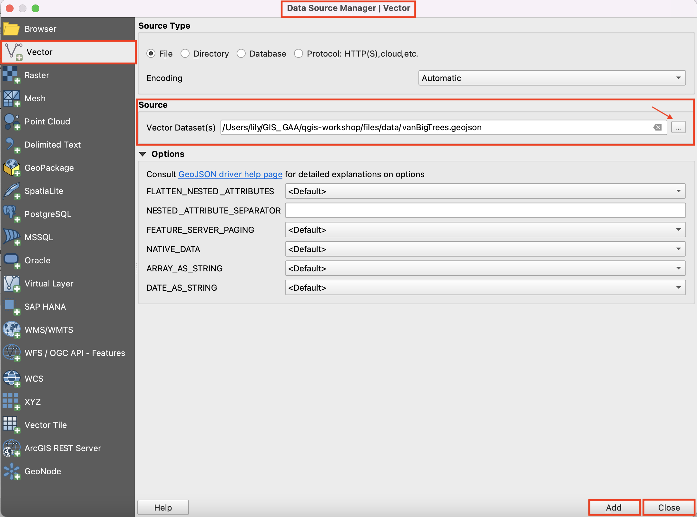
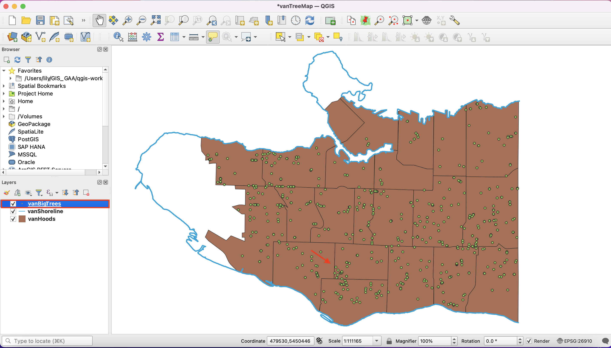
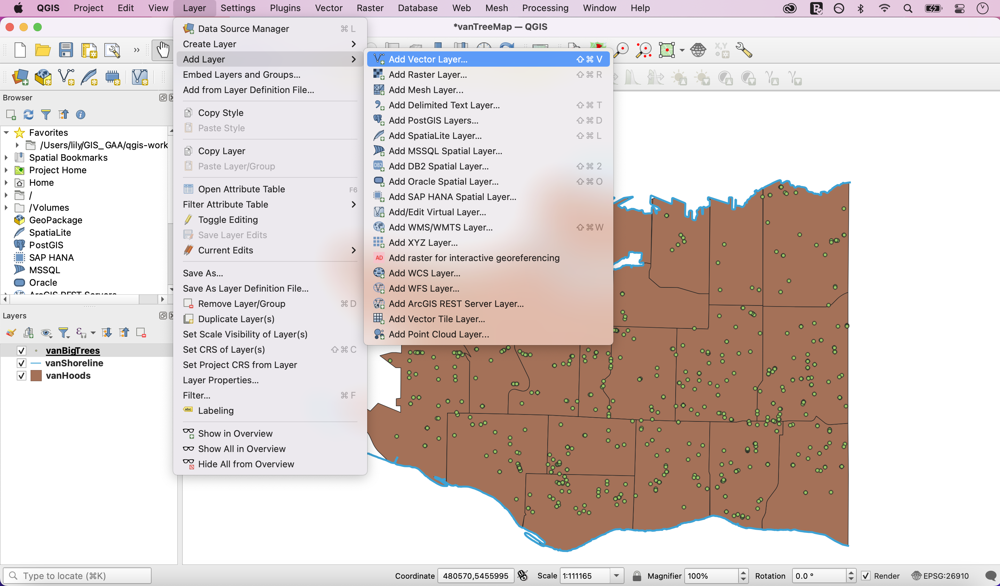

# Add Data

On the toolbars at the top of your screen, click the **Layer** button and select **Data Source Manager**. You can also open **Data Source Manager** directly from your docked **Data Source Manager Toolbar**. 

Select the **Vector** tab. For the vector dataset's source, click the three dots and navigate to your **intro-qgis-project-files\data** folder. Select the file named **vanBigTrees.geojson**. Click **Add**, then **Close**.

*You should see a new layer named **vanBigTrees** in your Layers Panel, as well as dots on your map canvas symbolizing the coordinate location of some trees.*

# Another pathway

A third way to add layers to your map canvas is through the **Layer** button at the top of your page. Under **Layer**, navigate to **Add Layer** and select **Add Vector Layer...** . This will open the same **Data Source Manager** dialogue box as before. 

There are often multiple ways to perform an action in QGIS. As you become familiar with the interface, you will find a workflow that suits you. 
