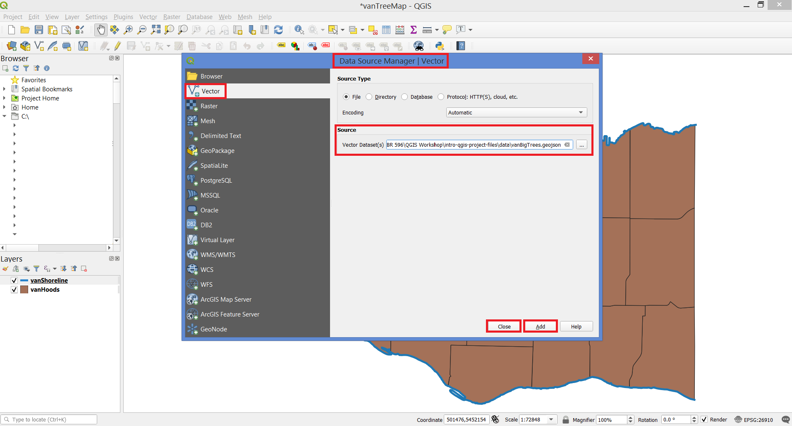

# Add Data

On the toolbars, click on the **Layer** button and select **Data Source Manager**.

Click on the **Vector** tab. For the vector dataset's source, navigate to your **intro-qgis-project-files\data** folder and select the file named **vanBigTrees.geojson**. Click **Add**, then **Close**.

*You should see a new layer named **vanBigTrees** in your Layers Panel.*

# Another pathway

On the toolbars, click on the **Layer** button, navigate to **Add Layer** and select **Add Vector Layer...** .

For the vector dataset's source, navigate to your **intro-qgis-project-files\data** folder and select the file named **vanBigTrees.geojson**. Click **Add**, then **Close**.

*You should see a new layer named **vanBigTrees** in your Layers Panel.*
