# Compose your map for print.
In the **Toolbar**, click on the **New Print Layout** button.

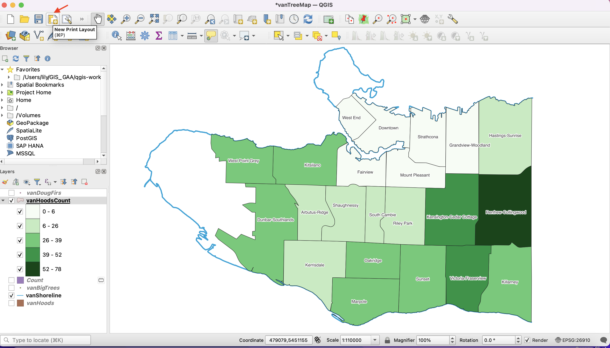

In the pop-up window, name the layout **Doug Fir Map**.

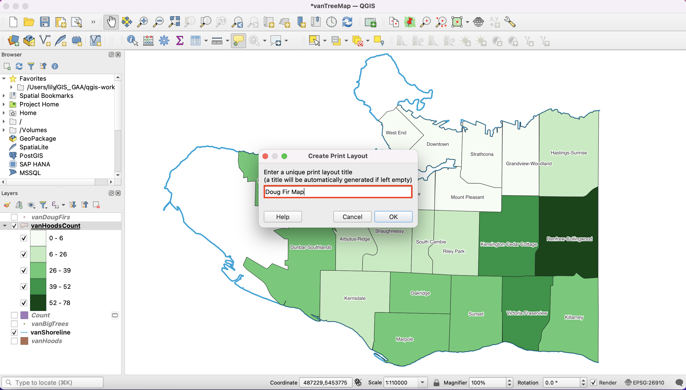

Right-click on the resulting page and select **Page Properties**. On **Item Properties**, change the layout to your desired dimension.

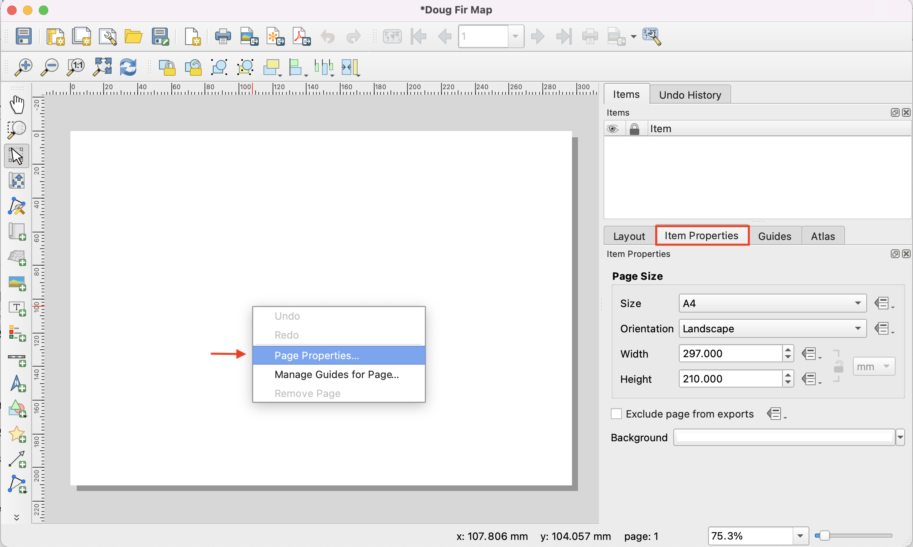

Using the **Add new map** button, add a new map to your layout, by clicking on the white canvas with the left button.

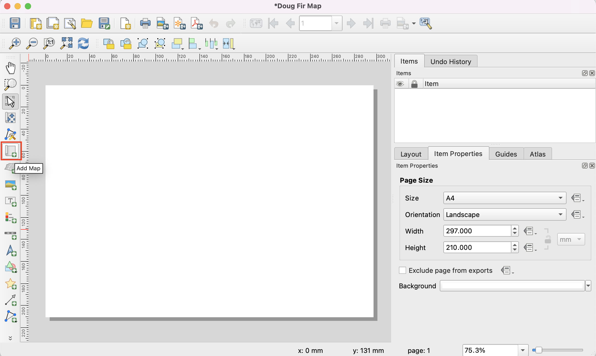

Click anywhere in the top left corner of your layout and drag diagonally across the page to add your map. Under **Items**, right click Map 1 and inspect **Item Properties**. Add the desired setting and press OK. You can also fine tune your map's placement using the **Move item content** button.

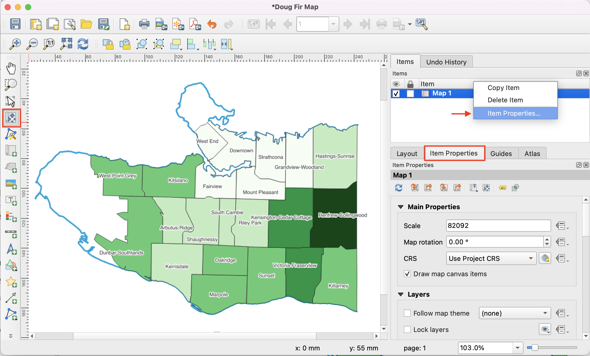

## Add a legend, scale bar, north arrow, and title.

### Legend
You'll need to add context to your map using some cartographic elements.  
Using the **Add legend** button, click and drag a box in the area you would like to place the legend.

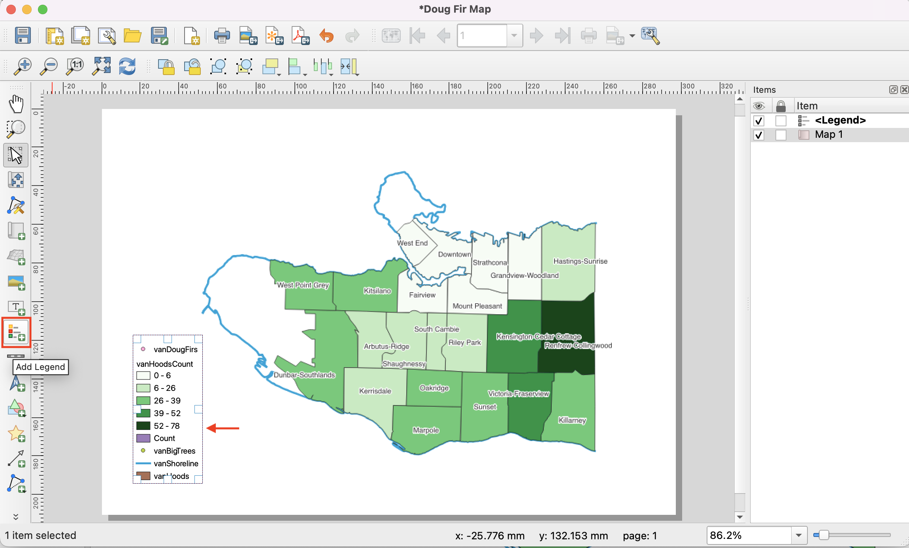

Right-click your legend and select **Item Properties**.

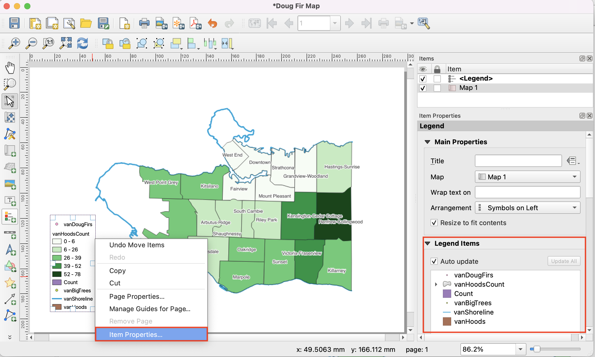

Only features symbolized by your map should be included in your legend. We will therefore remove all but **vanShoreline** and **vanHoodsCount** from our Legend Items. In the **Legend Items** section, first uncheck the 'Auto update' box. Now select a layer you want to remove from your legend and click the red **––** button at the bottom. 

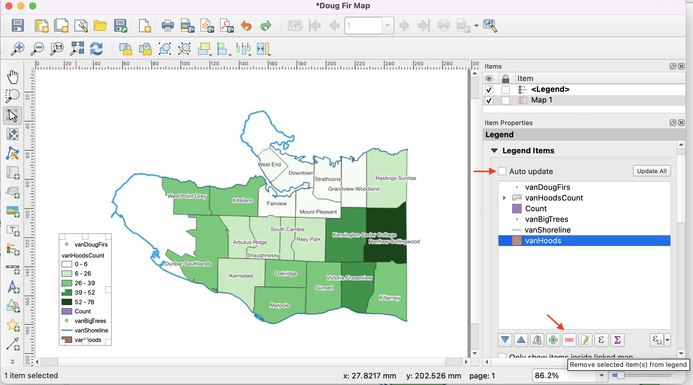

You should also rename **vanShoreline** and **vanHoodsCount** to something meaningful to your map's audience. To rename a legend item, simply double click and type in the text box that opens. Click the **<** back arrow to return to Legend Item Properties.

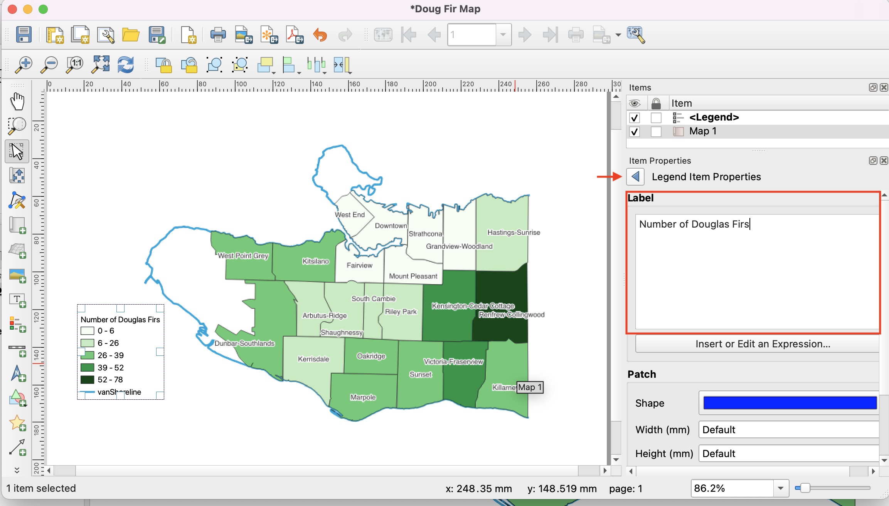

### Scale Bar
Click on the **Add scale bar** button, and click and drag on the map layout to create a bar. You may adjust the style in Item Properties. 

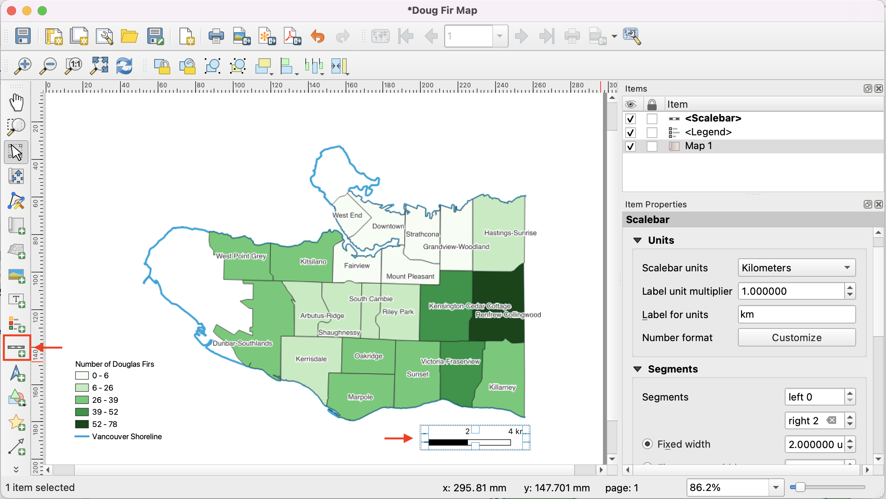

### Title
Using the **Add label** button, add the title: **Vancouver's Douglas Firs**. In Item Properties, scroll down to **Appearance** and click 'Font'. In the pop up window you can adjust the font and size of your title.   

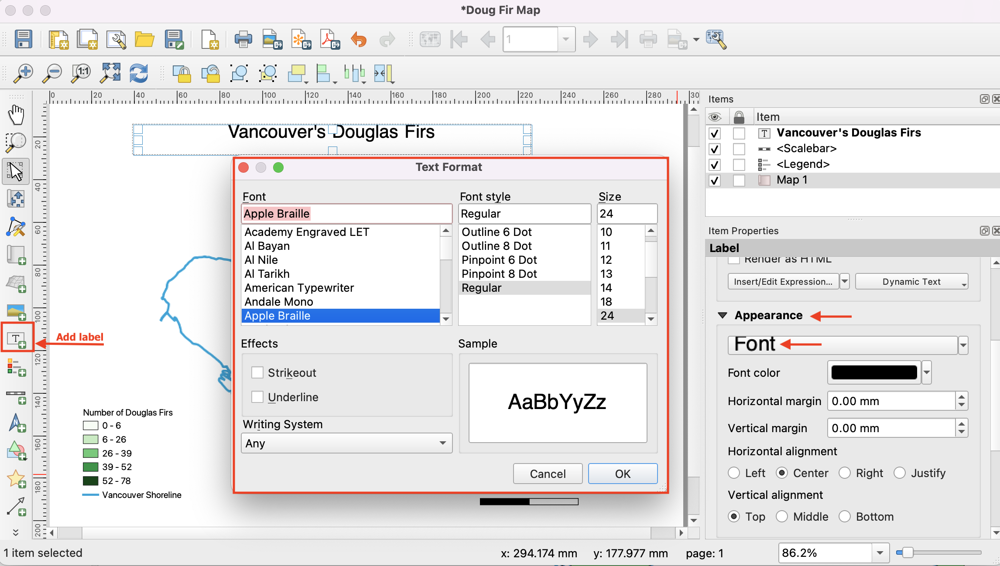

### North Arrow
Click the **Add a New North Arrow** button and drag a box on your map layout to create the arrow. In Item Properties, you will notice under **Picture** that your north arrow is currently an SVG (Scalable Vector Graphic) image. Click 'Raster image' instead and see what happens. 

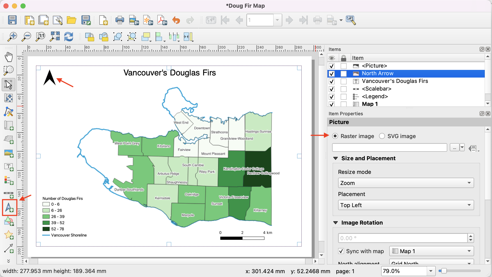

Under item properties, scroll down until you see Image Rotation. Choose **Sync with map**, then select the map you'd like to sync with. For type of **North alignment** select Grid North or True North.

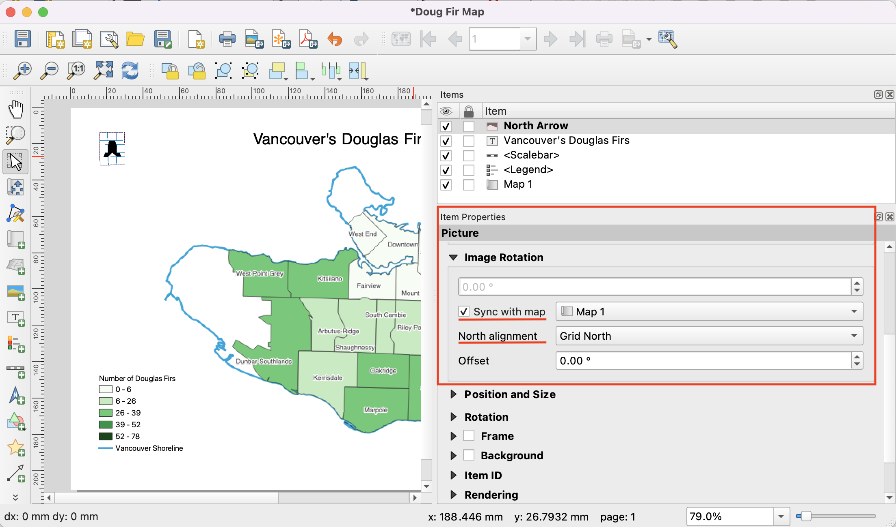

# Export your map for print.
In the Print Layout Menu, click on **Layout** and then on **Export as Image**.

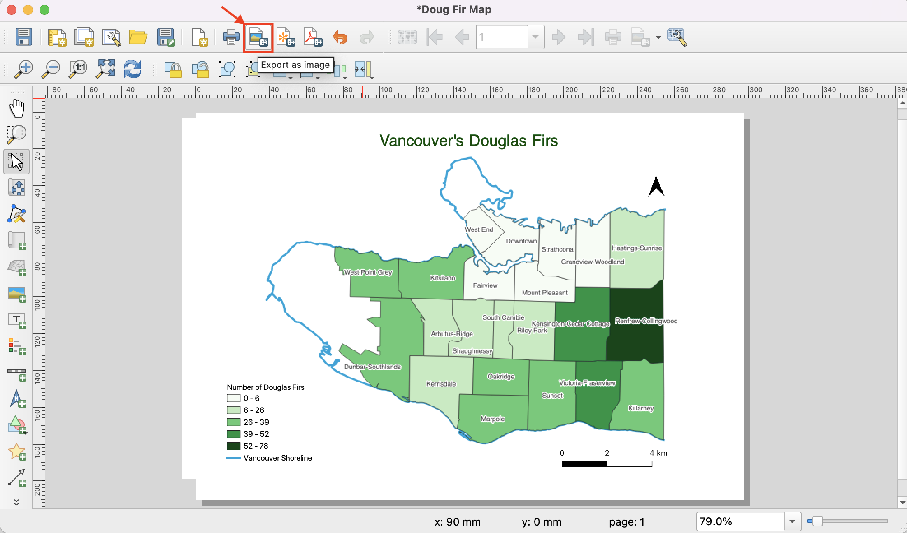

Save your file as a .jpeg image in your project folder. (Accept the Default Export Options if a window pops up.) Now you have a static image of your map and *you should get a message like this*

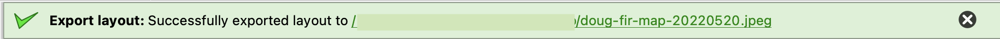

Close the print layout menu. Open your map .jpeg to see how it turned out. 
