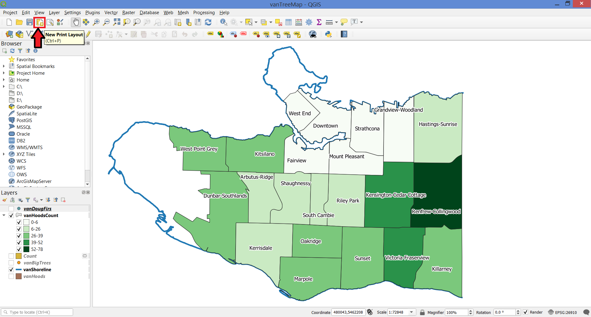
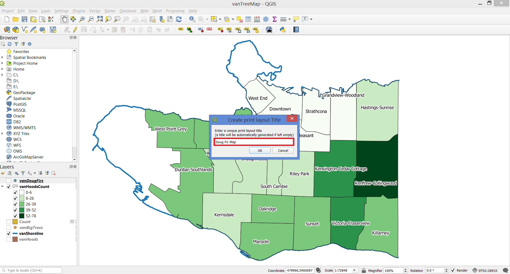
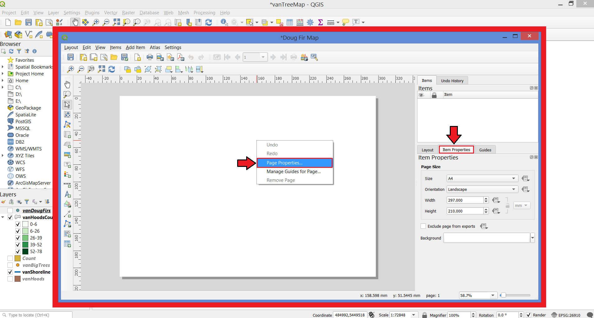
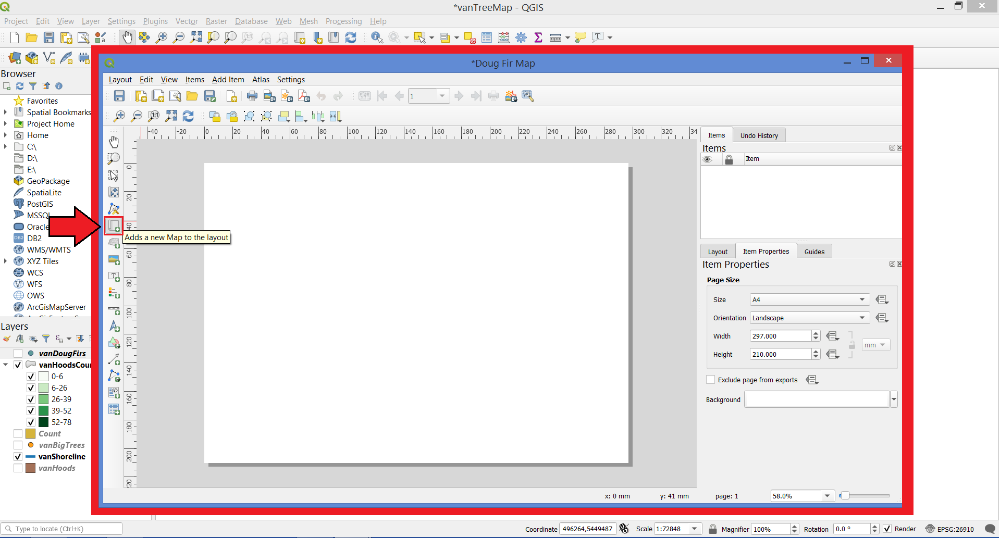
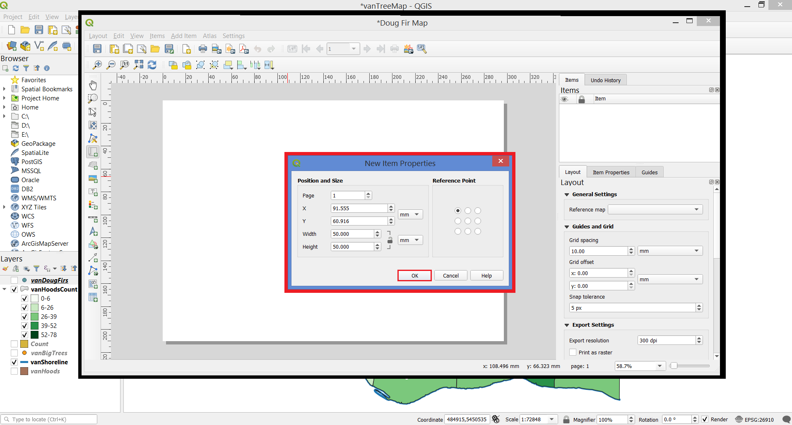
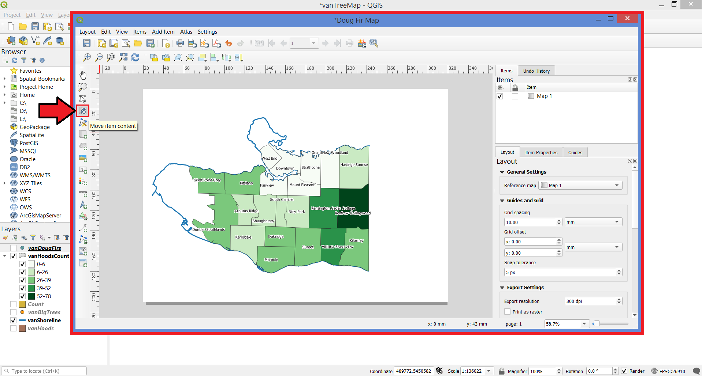

# Compose your map for print.
In the **Toolbar**, click on the **New Print Layout** button.

In the pop-up window, name the layout **Doug Fir Map**.

Right-click on the resulting page and select **Page Properties**. On **Item Properties**, change the layout to your desired dimension.

Using the **Add new map** button, add a new map to your layout, by clicking on the white canvas with the left button.

A **New Item Properties** window will pop. Add the desired setting and press OK.

Drag the map to cover the entire layout. Use the **Move item content** button to fine tune your map's placement.

## Add a legend, scale bar, north arrow, and title.
You'll need to add context to your map using some cartographic elements. Using the **Add legend** button, click and drag a box in the area you would like to place the legend. Right-click your legend and select **Item Properties**. Double-click your layer names and enter more relevant titles.

Using the **Add scale bar** button, add a scale bar to your map.

Using the **Add title** button, add a title **Vancouver's Douglas Firs**.

### North Arrow
Using the **Add picture** button, select the Arrow folder, then pick whichever arrow you would like. (Alternately, select a custom arrow or any other image).

Then, select the image from the list of items added to the map if it is not already selected.

Under item properties, scroll down until you see Image Rotation. Choose **Sync with map**, then select the map you'd like to sync with. For type of alignment, select **Grid or Magnetic north**.

### Export your map for print.
In the Print Layout Menu, Select the option to **Export as Image**. Save your file as a .jpeg image in your project folder. Now you have a static image of your map.

Close the print layout menu.
