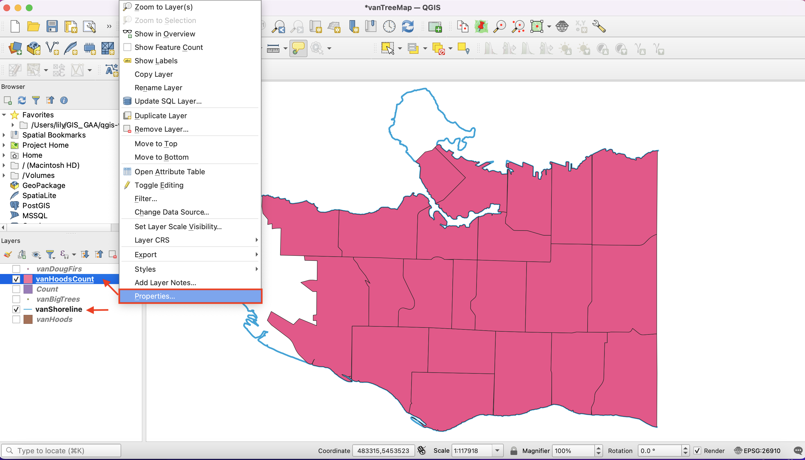
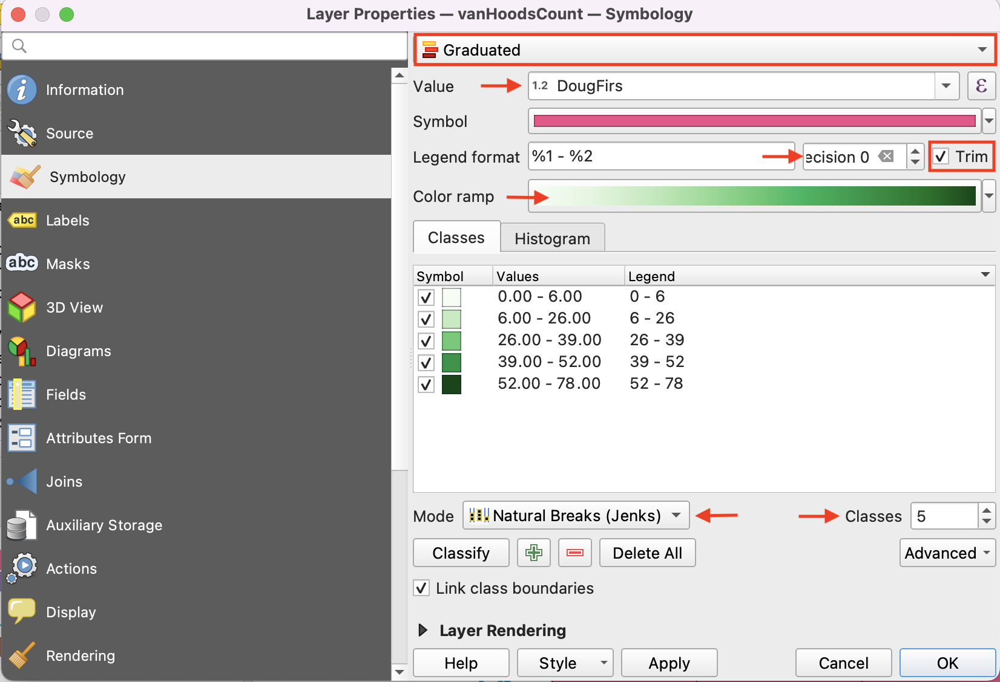
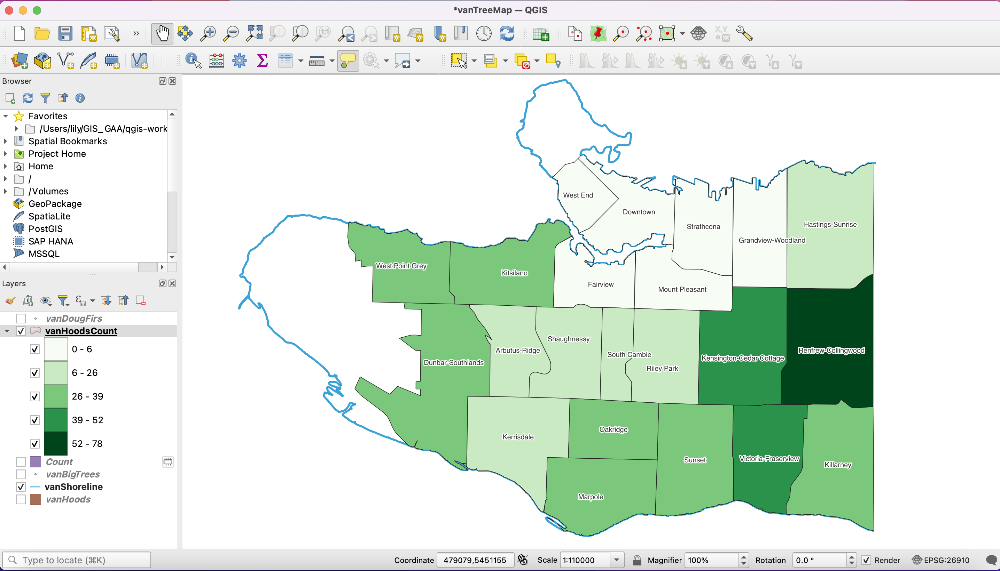

# Create a Choropleth Map

In your layers panel, hide (uncheck) everything except your **vanHoodsCount** and **vanShoreline** layers.

Right-click on the **vanHoodsCount** layer and select **Properties**.

On the new window, select the **Symbology** tab.

At the very top, there is a button where **Single Symbol** is selected.

Click on that button and select **Graduated**. This will allow you to display graduated colours representing classes of attribute values.

On **Value** select: DougFirs  
On **Precision** select: 0  
Check the box for **Trim**  
**Color Ramp:** pick a color ramp that looks like it would represent the prevalence of Douglas Firs.     
On **Mode** select: Natural Breaks (Jenks)  
On **Classes** select: 5  
Click **Apply** and drag/resize your symbology window so you can see your map canvas. When you are satisfied, click **OK** and close the window.  

*Your map should look like this:*

