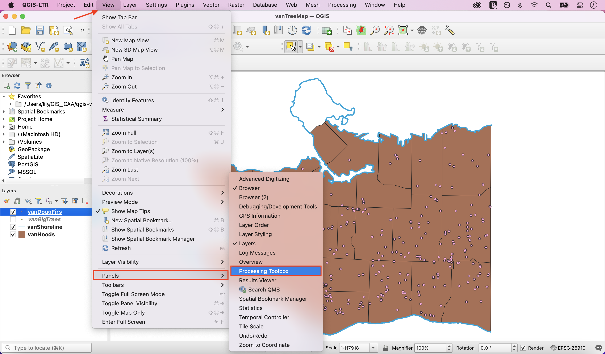
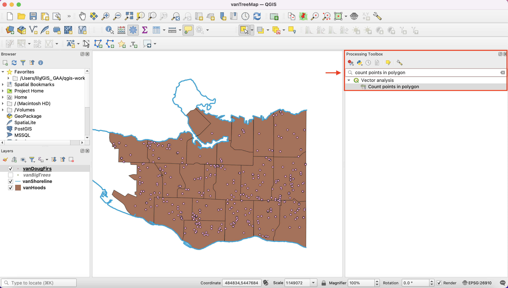
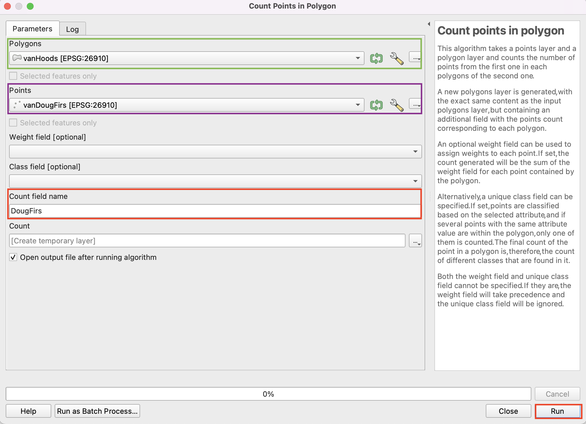
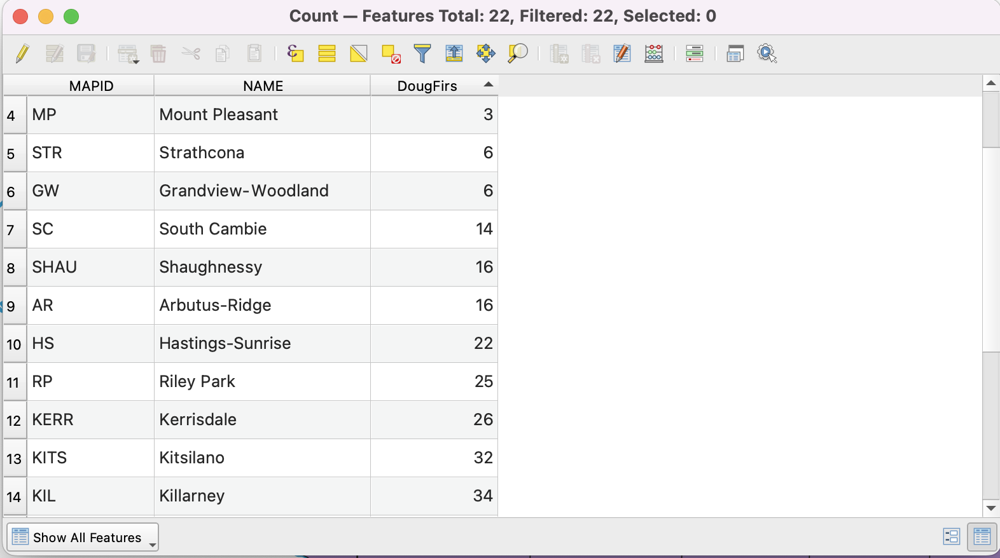
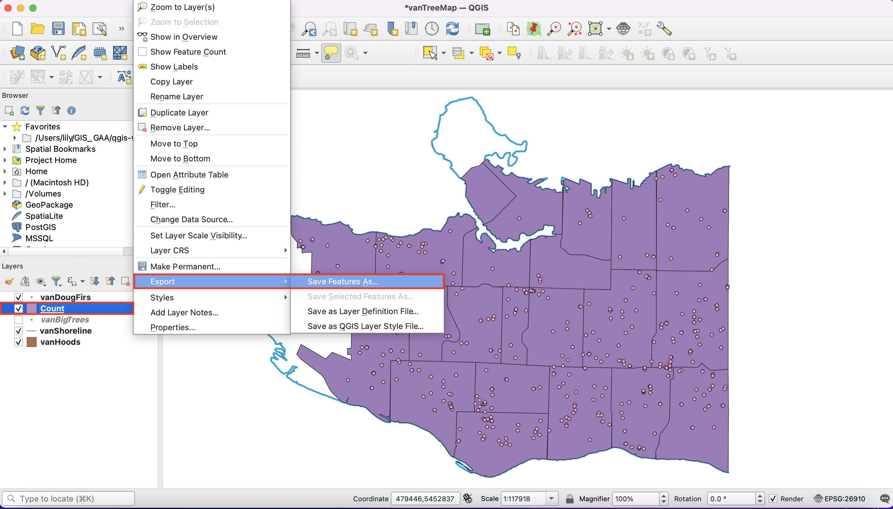
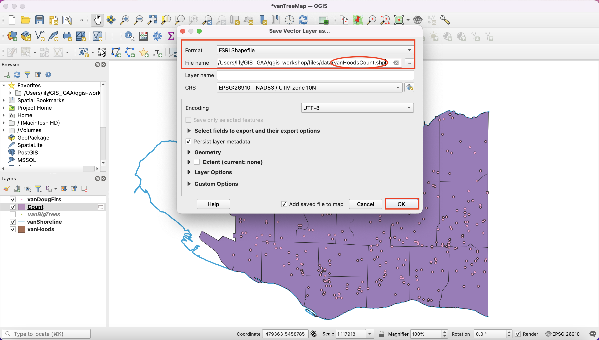
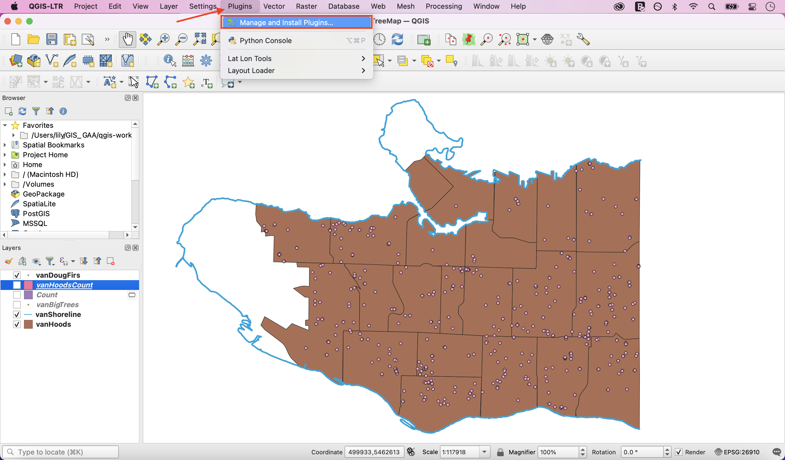
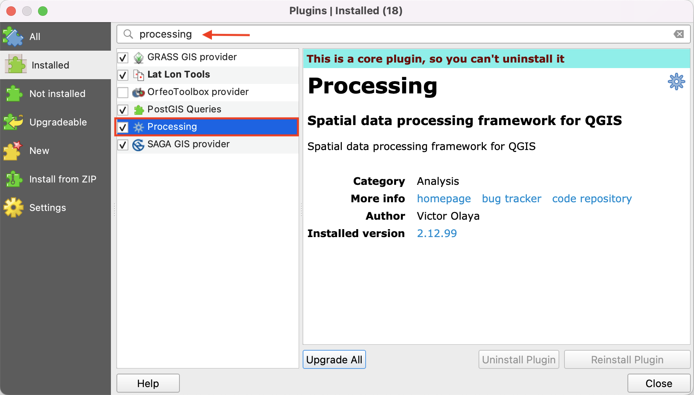

# Geoprocessing Toolbox

## Count the number of Douglas Fir trees in each neighbourhood.
In the Main Menu, click on **View**, scroll down to **Panels** and select **Processing Toolbox**.

*In case you can't find the **Processing Toolbox** option, [click here](https://ubc-library-rc.github.io/gis-intro-qgis/content/geoprocessing-toolbox.html#enable-processing-plugin).*

This is where you can find a large number of analytical and geoprocessing tools. 

In the search bar, type "count points in polygon" and double-click the result.

In the new window, select:

**Polygons:** vanHoods (your input polygon layer)   
**Points:** vanDougFirs (your input points layer)   
**Count field name:** DougFirs (the name of the attribute that will have Doug Fir counts)

Click **Run**, then **Close** when the process has finished. *Note: you may see the caution 'No spatial index exists for points layer, performance will be severely degraded'. You can ignore this.*

*You should now have a new layer called **Count***. Drag **Count** below **vanDougFirs** in Layers Panel so the distribution of Douglas Firs remains visible on your Map Canvas. Take a look at the attribute table for **Count**. You can now see the number of Douglas Firs in each Vancouver neighbourhood. Close the attribute table to continue. 

Save this layer to your data folder by right-clicking and selecting **Export - Save Features As..**

In the new window, select

**Format:** Esri Shapefile    
**File name:** navigate to the location of your project's data, save the file as **vanHoodsCount** and click **OK**. 

## Enable Processing plugin

*In case you didn't find the **Processing Toolbox***:

In the **Main Menu**, click on **Plugins**, then click on **Manage and Install Plugins...**

On the search bar, type in **Processing**. Select the Processing box and then click **Close**.

You should now see the **Toolbox icon** and be able to proceed with the next steps.

