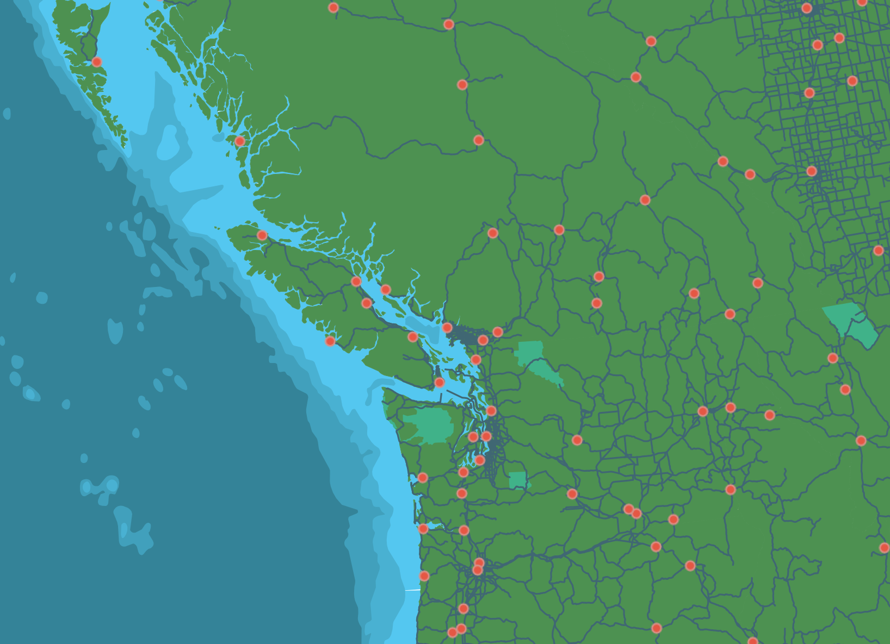

# Geospatial Data

A Geographic Information System (GIS) works with data that is tied to a location on Earth. This type of data is often referred to as *GIS data*, or *geospatial data*, and is spatially referenced to Earth using location information – most commonly geographic coordinates. A GIS uses this location information to project a geospatial file into a virtual geographic space where it can then be visualized and analyzed.

## Types of Geospatial Data

Geospatial data is often referred to as having two main types: **raster** and **vector**. These two data types, while both geospatial, are very different from one another. Raster data is data which is made up of pixels arranged in a grid, whereas vector data is made up of vertices and the paths between them – creating geometries that represent real-world features or phenomena.

### Vector Geospatial Data
Vector data is made up of vertices and the paths between them – creating geometries that represent real-world features (such as a lake or street intersection) or phenomena (like a contour line indicating an elevation). There are 3 kinds of vector geometries in GIS: points, lines, and polygons.
 
#### Points
A geometry that is made of a single vertex (a point) is used to represent a single location, such as a city, tree, or address location. Point geometry consists of an x and y vertex, often a lat/long coordinate pair. (Note that the x value would be longitude and the y value would be latitude in this case.) 
 
#### Lines
Two or more points connected by a path are lines. Lines are used to represent things like street centerlines, administrative boundaries, rivers, etc.
 
#### Polygons
Polygons are three or more points connected by a path and closed to form an area. Polygons are used to represent areas like lakes, building footprints, provinces, or parks.    

Below is a map consisting of vector data, with cities (points), major roads (lines), land/water (polygons), and parks (polygons). 

 
### Raster Geospatial Data
Raster data is stored as grid of values which are rendered by a GIS as coloured pixels. Continuous geospatial features such as satellite imagery, topography, or the results of spatial calculations are raster data. 

 
## Tabular Data in GIS
Tabular data is data formatted into a table by **rows** and **columns**. The attribute table of a shapefile is an example of tabular data. You can also add a tabular dataset, such as a .csv (commma separated value) file, directly to a GIS and A) join it with a shapefile based on a matching column, or B) project it given coordinate pairs are present.

