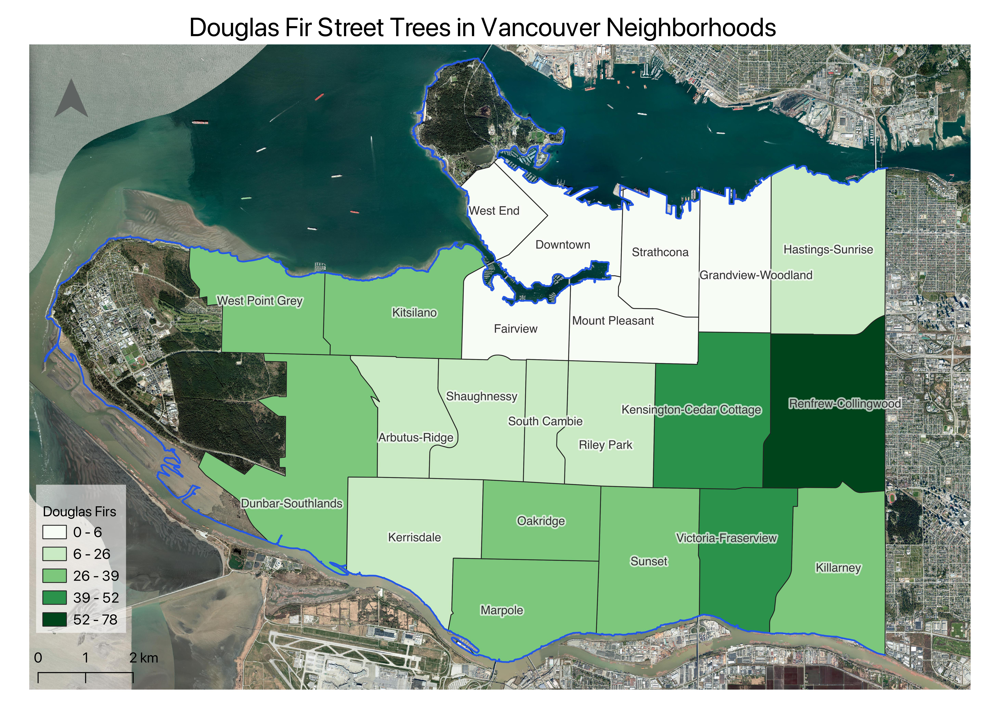

# Hands on with QGIS

 
*1*{: .circle .circle-green} To get started with this workshop, you'll need to first download the data and files from this GitHub repository. To do this, click on the 'Download Data' button below to start the download. Once complete, **extract the contents of the .zip file**.

[Download Data](./qgis-intro.zip){: .btn .btn-blue }
    

 
*2*{: .circle .circle-green} Open the new **intro-qgis-project-files** folder. This is your project folder which contains the items:
- **data** subfolder: where your project data is stored. All of these files are derived from data found from the [City of Vancouver's Open Data Catalogue](https://vancouver.ca/your-government/open-data-catalogue.aspx).
- **vanTreeMap.qgz**: a QGIS project file containing the workshop's maps and data
    

 
*3*{: .circle .circle-green} Double click **vanTreeMap.qgz** to open the QGIS project. 

---
For this workshop, we will begin with a pre-made project that contains *clean* data that is organized into folders. The project file contains paths to data layers so that they load in the Map Canvas when the project starts. The project file also contains any style settings that have been applied to your data layers. It is important that you keep the paths to your data layers intact to avoid broken links. The **best practice** is to keep your data organized in folders associated with your project so that they are logically arranged in folder systems from the very start of any project.

Another real-world scenario is that you would begin your project by searching for and evaluating data that you need, which can be a time consuming (and potentially expensive!) step. It's also common to have to clean, transform, or otherwise process your data in order for it to work correctly in your GIS project. We are avoiding that step by design for this introductory workshop.

The map we will make will look something like this:

