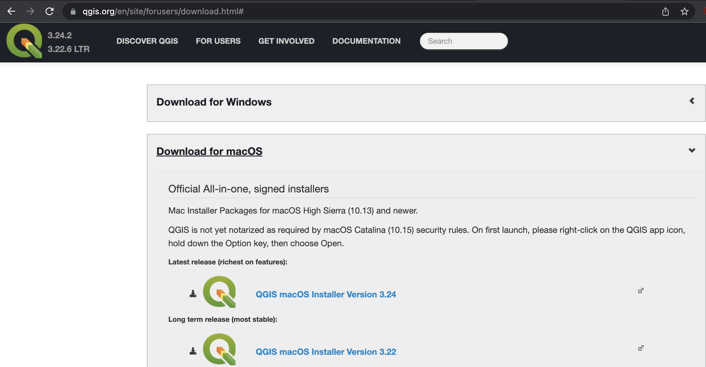

# Installing QGIS

QGIS can be downloaded from [qgis.org's Downloads page](https://qgis.org/en/site/forusers/download.html). In most cases, you'll want to download and install the **Long term release** instead of the latest release.

This will give you most of the functionality you'll need, without encountering the software bugs of newly released versions.
