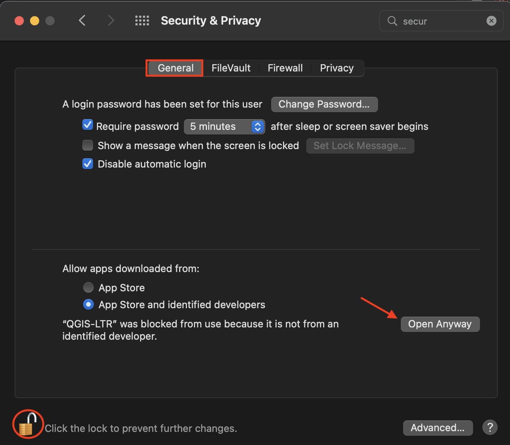

# Installing QGIS

QGIS can be downloaded from [qgis.org's Downloads page](https://qgis.org/en/site/forusers/download.html). In most cases, you'll want to download and install the **Long term release** instead of the latest release. This will give you most of the functionality you'll need, without encountering the software bugs of newly released versions.

    
      

    
 

### Troubleshooting
If you're working on a MacOS and get the message: _"QGIS-LTR can’t be opened because Apple cannot check it for malicious software"_ when you try to open the application, go to System Preferences --> Security & Privacy --> General and unlock your settings. At the bottom of the dialogue box you will see an option to Open Anyway. Click that, then re-lock your settings and try again to open the QGIS-LTR application. 

