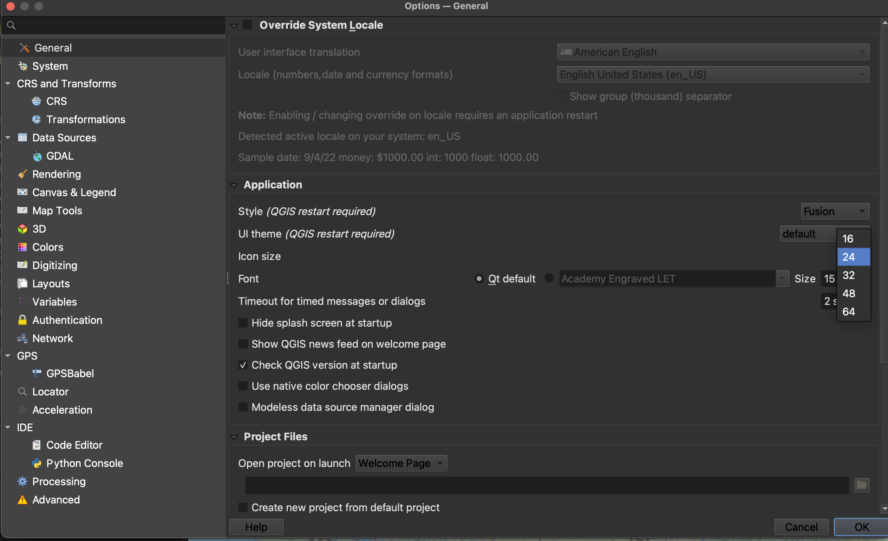

## Increasing Icon and Font Size
To increase the size of icons and text on your interface, go to the **Settings** menu at the top of your screen and click on **Options**.
   

Resize the dialogue box so you can see the drop-down for "icon size" and "font." Icon changes will happen as soon as you click OK. Changes in font size won't update until you quit and restart QGIS, so make sure you save your project now. 
   

