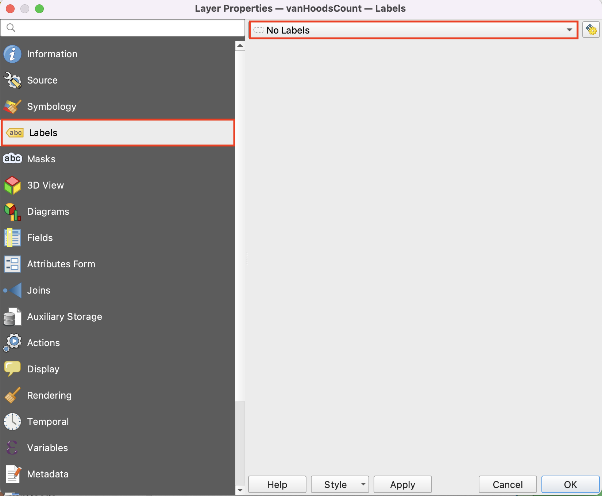
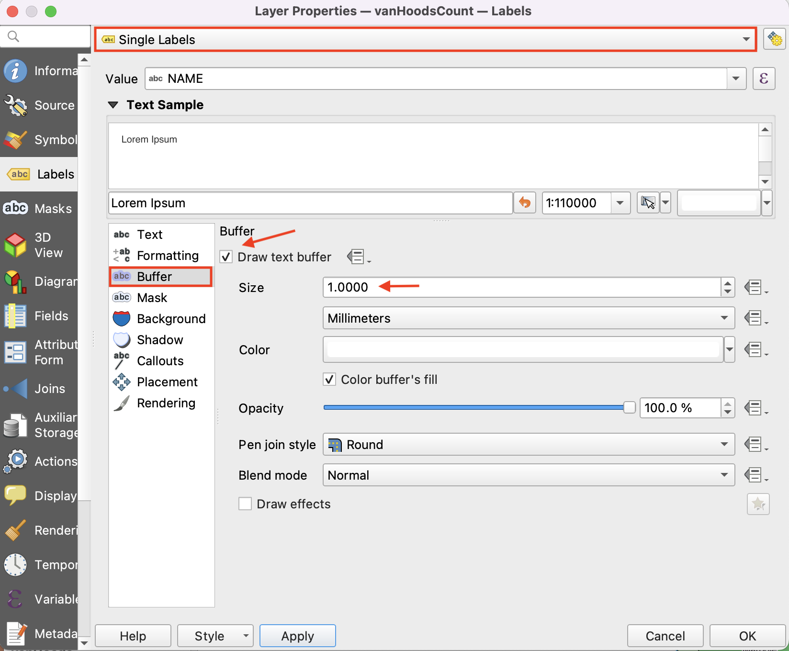
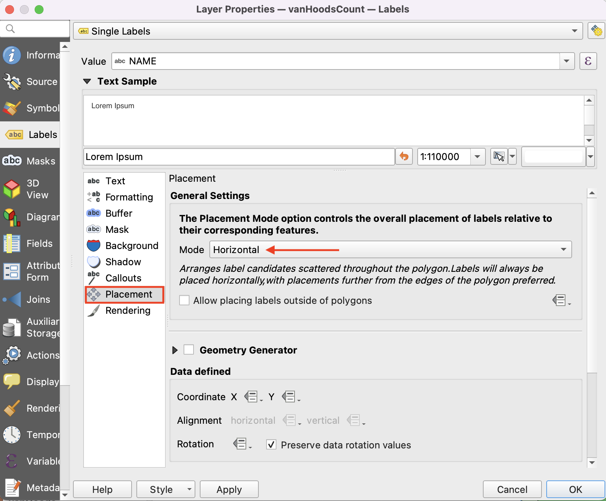
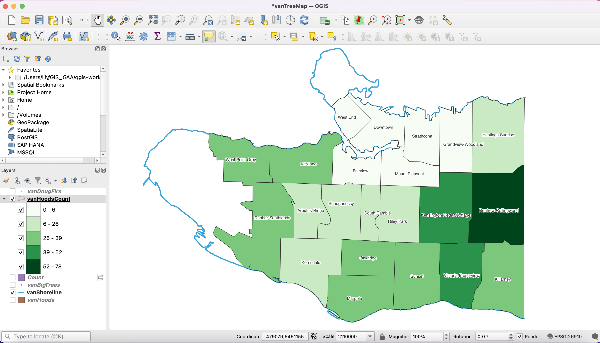

# Label Neighbourhoods

Right-click your **vanHoodsCount** layer, click on **Properties**. On the new window, select the **Labels** tab.  
At the very top, there is a button where **No labels** is selected.

Change **No Labels** to **Single labels.**

On **Value** select: NAME    
On **Buffer**, check the "**Draw text buffer**" box. This can help with displaying dark text over dark coloured maps.   

Next, click on **Placement** and select: **Horizontal**

Click **Apply** to see your changes, and make any stylistic adjustments. Click **OK** when done.

*Your map should now look like this:*

