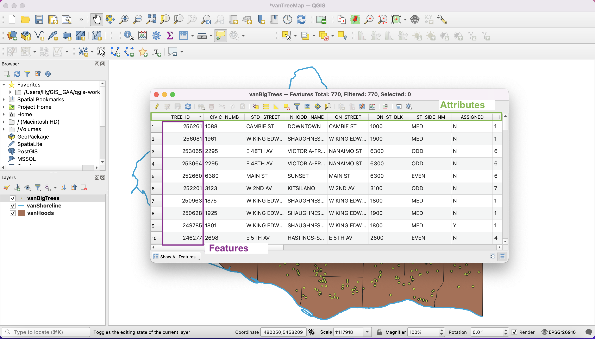

# Layer Attributes

## Examine the attributes in your trees layer.
In the **Layers Panel**, right-click the title for the trees layer, and select **Open Attribute Table**.

*You should see your attribute table*. Note that there are several attributes (columns) that describe each feature (rows) in this dataset.

