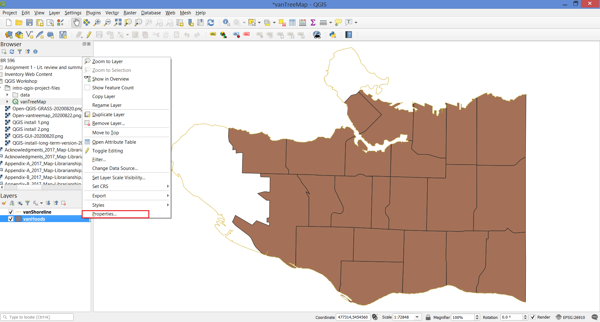
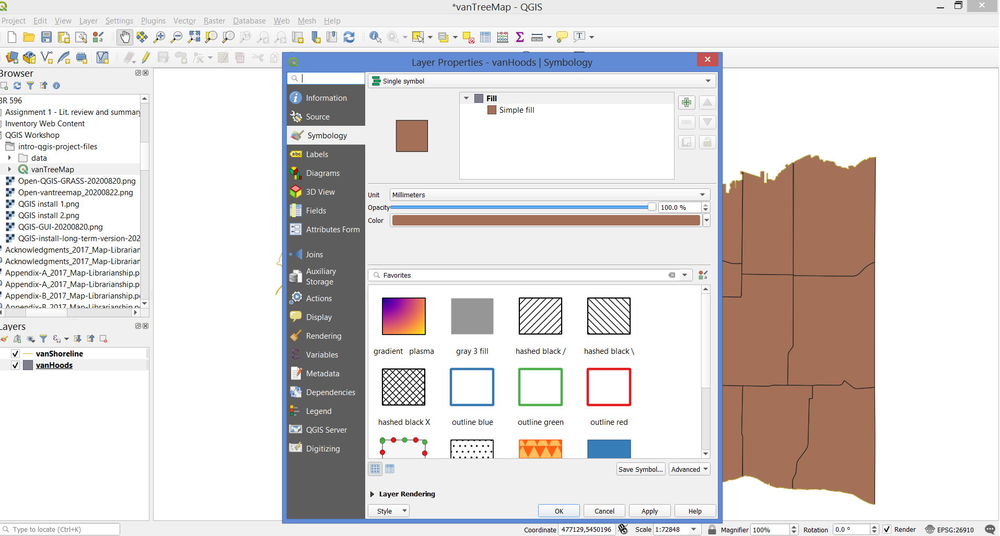
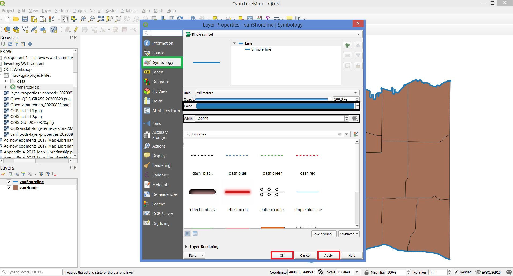

# Layer Properties

Your new project displays 2 layers in your Layer Panel - which are 2/3 of the files in your **data** folder. Each one of these layers.    

In the Layers Panel, right-click the title of the **vanHoods** layer, and select **Properties**.

Observe some of the layer properties and close the window.

## Change the shoreline boundary width and colour
In the Layers Panel, right-click on the title of the **vanShoreline** layer and select **Properties**.

In Layer Properties, select the tab for **Symbology**, and change the line width to **1**. Next, change the colour of the line to **blue**. Click **Apply** and then **OK**.

*You should see a slight change in the width of the shoreline and your line should now be blue*.

