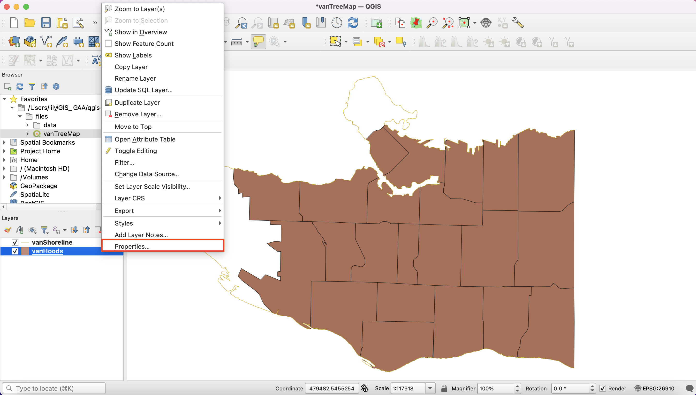
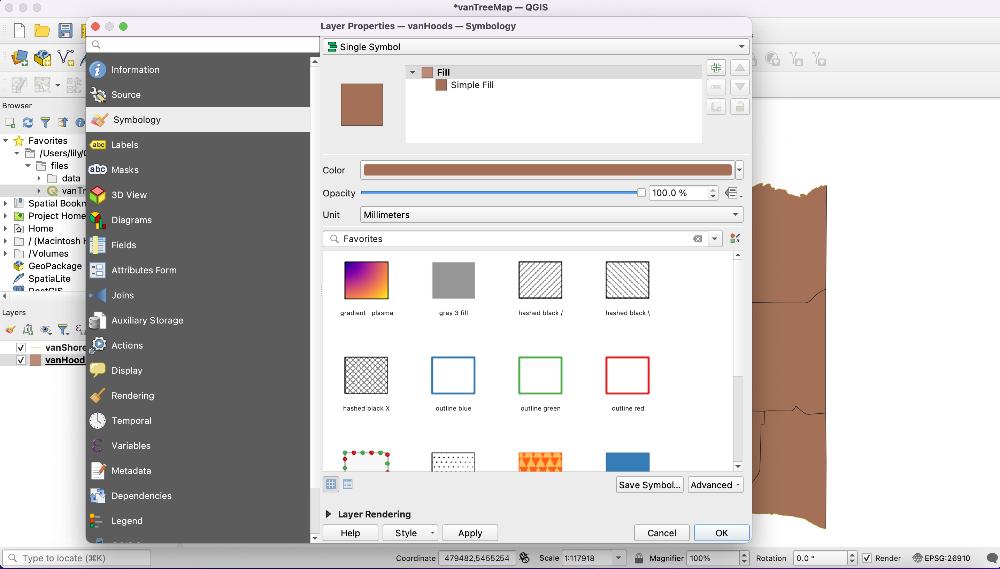
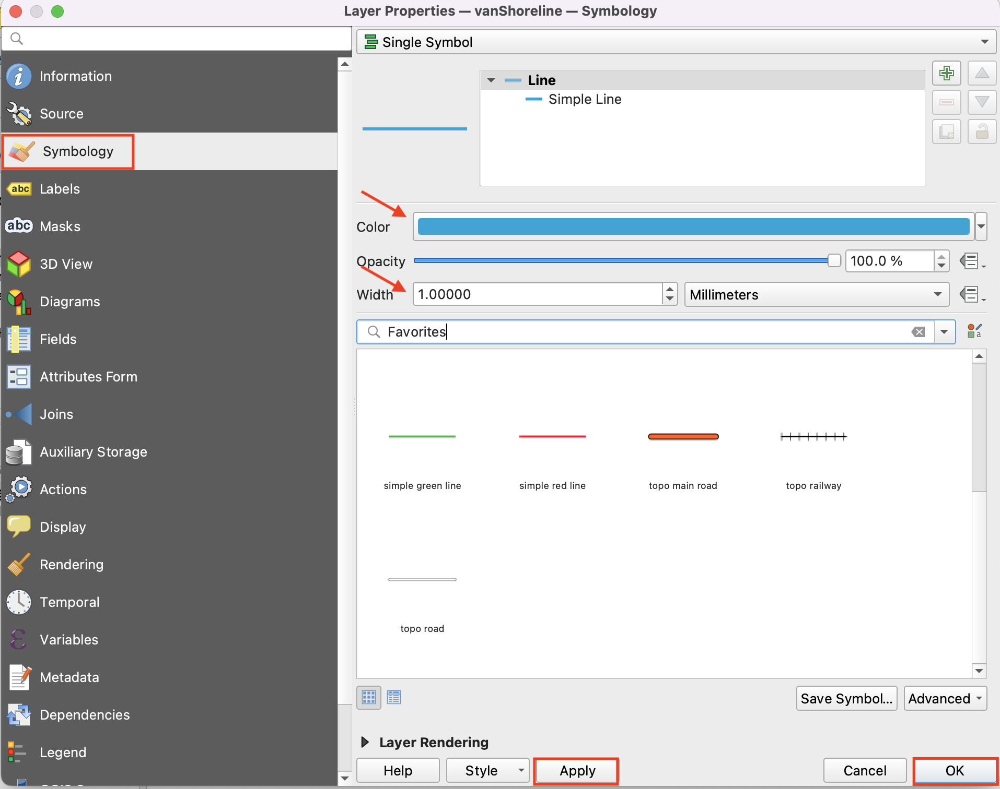
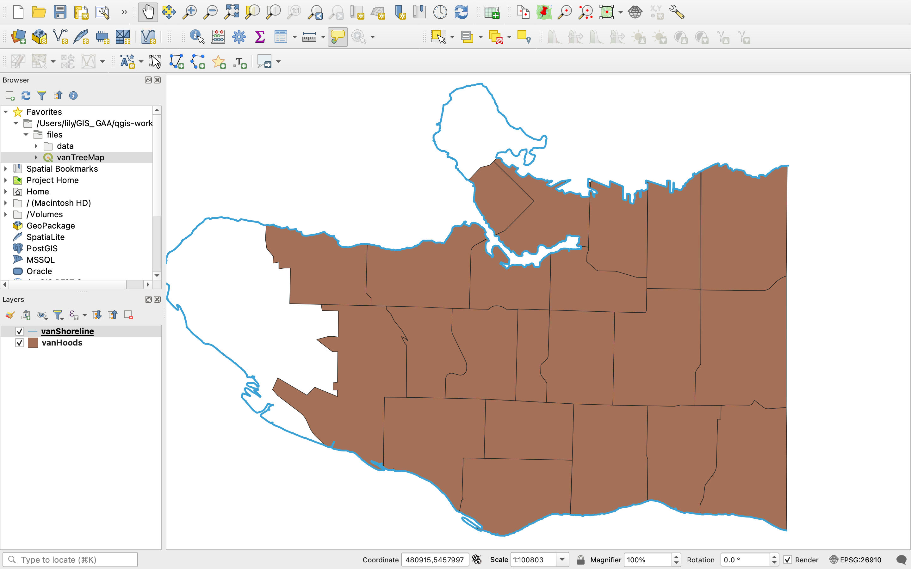

# Layer Properties

Your new project currently displays 2 layers in your Layer Panel.    

In the Layers Panel, right-click the layer **vanHoods**, and select **Properties**.

After observing the layer properties, close the window.

## Change the shoreline boundary width and colour
In the Layers Panel, right-click on the title of the **vanShoreline** layer and select **Properties**.

In Layer Properties, select the tab for **Symbology**, and change the line width to **1mm**. Next, change the colour of the line to any **blue**. Click **Apply** and then **OK**.

*You should see a slight change in the width of the shoreline and your line should now be blue*.

