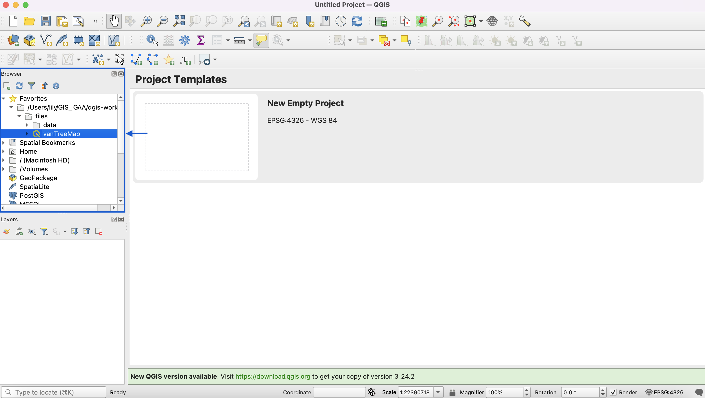

# The QGIS project file (.qgz)

If you haven't already, open QGIS. 

In the Browser Panel, navigate to the directory where you added your newly extracted folder called **intro-qgis-project-files**. Inside you'll see the **vanTreeMap** project file. Double-click that file to open the project. Note: for a better look at any of the workshop's instructional images, right click the image and select **Open Image in New Tab**.

