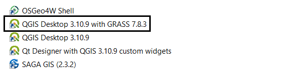
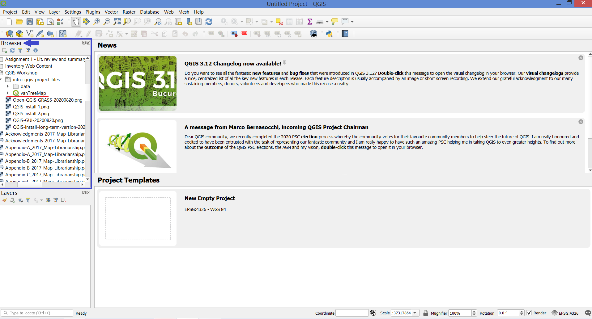

# The QGIS project file (.qgz)

If you haven't already, Open QGIS 3.10.9 (with GRASS).

In the Browser Panel, navigate to your Desktop, and select your newly extracted folder called **intro-qgis-project-files**. Inside you'll see the **vanTreeMap** project file. Double-click that file to open the project.

