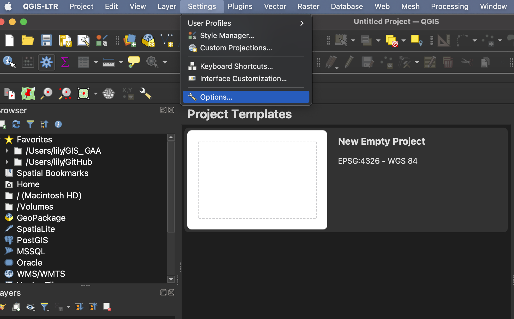

# QGIS Graphical User Interface (GUI)
Once you have opened the vanTreeMap project your interface should look like this:

**Toolbars** - Toolbars are where you will find the most useful geoprocessing, editing, navigation, and other tools. You can customize this area of your GUI to fit your needs. 
    
**Browser and Layers Panel** - The browser panel lets you easily navigate your file system for data and project files. Your layers panel displays your project's data layers and provides access to configuration settings. If you ever accidentally close a Panel, you can open it again by going to the **View** Menu at the top of your screen, down to **Panels** and then selecting the ones you wish. You can also right-click anywhere in the toolbar's greyspace and select Panels and Toolbars to show/hide. 
 
**Status Bar** - The status bar displays current information about the map canvas, and allows you to make adjustments in the map's scale and rotation.    
 
**Map Canvas or Map View** - Call it either one. This is where the map is displayed as layers are loaded. You can zoom/pan the map canvas as well as select features and other operations.    

## Interface Preferences 
You can change the look and feel of your GUI, as well as adjust default settings from **QGIS-LTR --> Preferences** or **Settings --> Options.** 

### Increasing Icon and Font Size
To increase the size of icons and text on your interface, go to the **Settings** menu at the top of your screen and click on **Options**.
   

Resize the dialogue box so you can see the drop-down for "icon size" and "font." Icon changes will happen as soon as you click OK. Changes in font size won't update until you quit and restart QGIS, so make sure you save your project now. 
   

   
