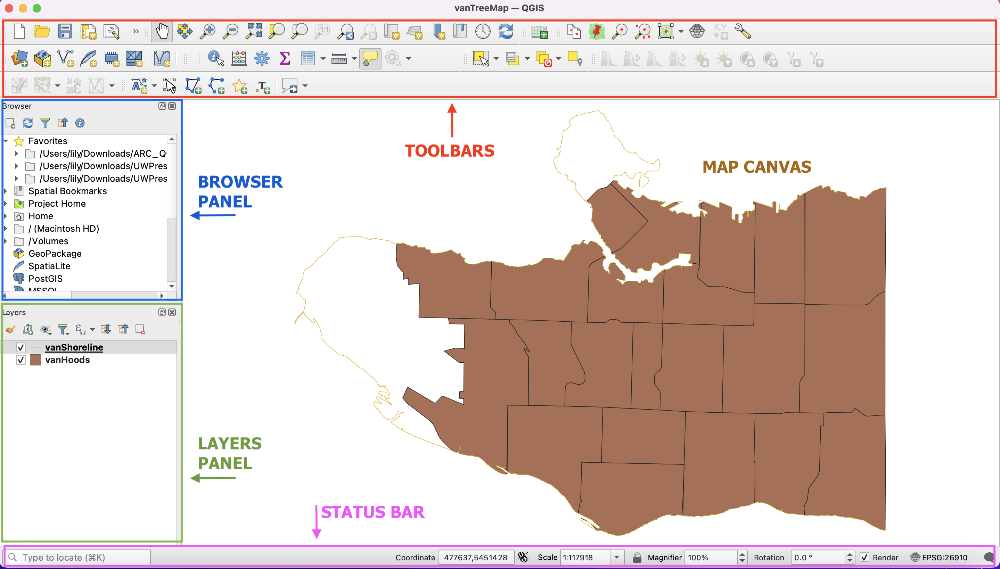
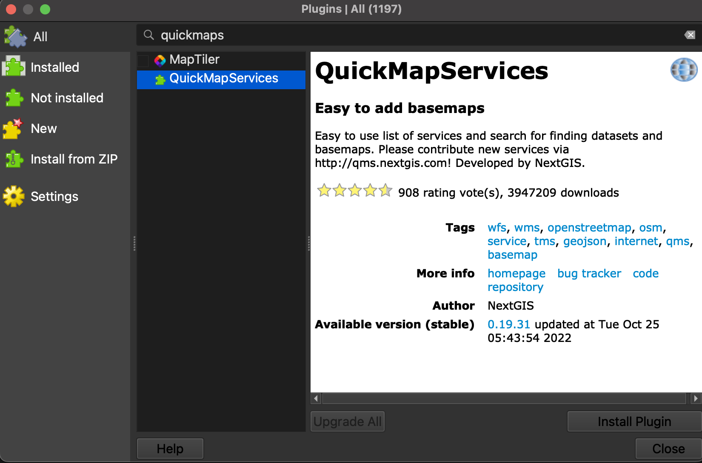

# QGIS Graphical User Interface (GUI)

**Toolbars** - Toolbars are where you will find the most useful geoprocessing, editing, navigation, and other tools. You can customize this area of your GUI to fit your needs.    
**Browser and Layers Panel** - The browser panel lets you easily navigate your file system for data and project files. Your layers panel displays your project's data layers and provides access to configuration settings.   
**Status Bar** - The status bar displays current information about the map canvas, and allows you to make adjustments in the map's scale and rotation.    
**Map Canvas or Map View** - Call it either one. This is where the map is displayed as layers are loaded. You can zoom/pan the map canvas as well as select features and other operations.    

   
## OPTIONAL: Add basemap from web plugin
Even though Vancouver currently appears to be floating in a sea of white, your shapefile is georeferenced meaning QGIS knows where on Earth Vancouver is. Adding a basemap helps give your map spatial context. While this step is **not required** for this workshop, below are instructions to add a web-based basemap to your project. 

### Install Plugin
[QGIS plugins](https://plugins.qgis.org/) are user developed tools that extend QGIS functionality beyond the basics. To access basemaps, we'll first install the OpenLayers plugin. Click on the **Plugin** menu at the top of your screen and select **Manage and Install Plugins...**
   
   
In the dialogue box that opens, select **All** as a search category on the left and type "QuickMapServices" as one word. Install the plugin and close the dialogue box.

### Add Basemap
Now go to the **Web** menu at the top of your screen. You should see the QuickMapServices plugin. Hover over it and click "Settings" at the bottom of the menu that pops up. In the settings dialogue box go to the "More services" tab and click "Get contributed pack." Click **save** to close settings and return to the **Web** menu. This time when you hover over the QuickMapServices plugin you will see an array of basemap options. Select OpenStreetMap as your basemap. Like QGIS, [Open Street Map (OSM)](https://www.openstreetmap.org/about) is open source and user developed.   

Make sure to drag your basemap to the bottom in your Layers Panel. Remove the basemap at anytime by right clicking the layer and selecting "remove." 

If you find web-based maps interesting, check out the Research Commons' [Leaflet Workshop!](https://ubc-library-rc.github.io/gis-intro-leaflet/) 
{: .note}
