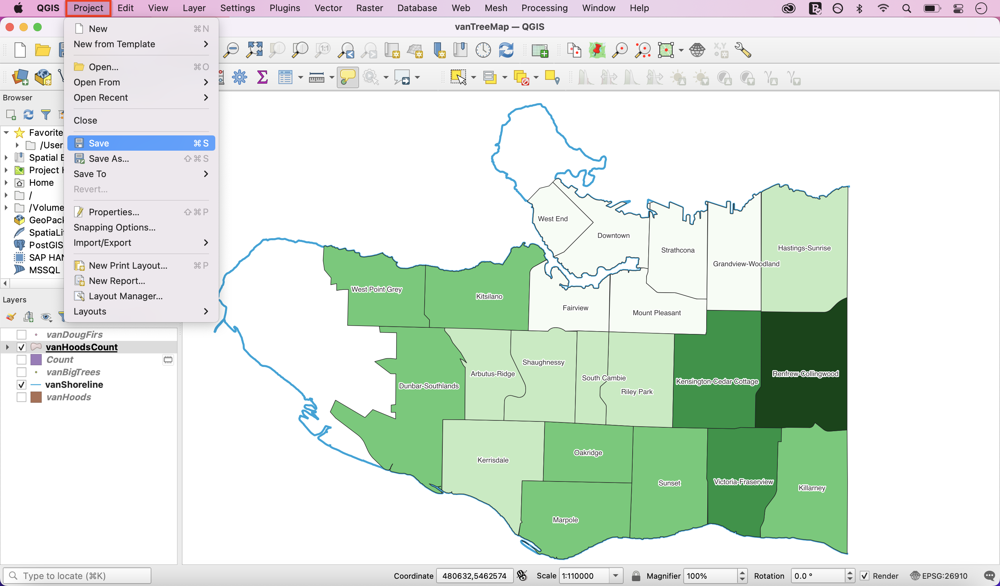
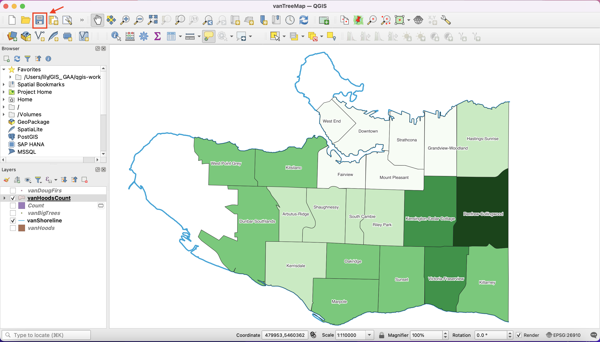
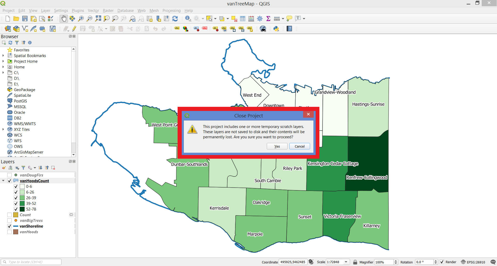

# Save Your Project

In the toolbar, select **Project**, then click on **Save**. 

You can also save your project by clicking the **Save Project** button from your docked toolbars. 

*You might get an error message like this* You can ignore this and close your project. 

