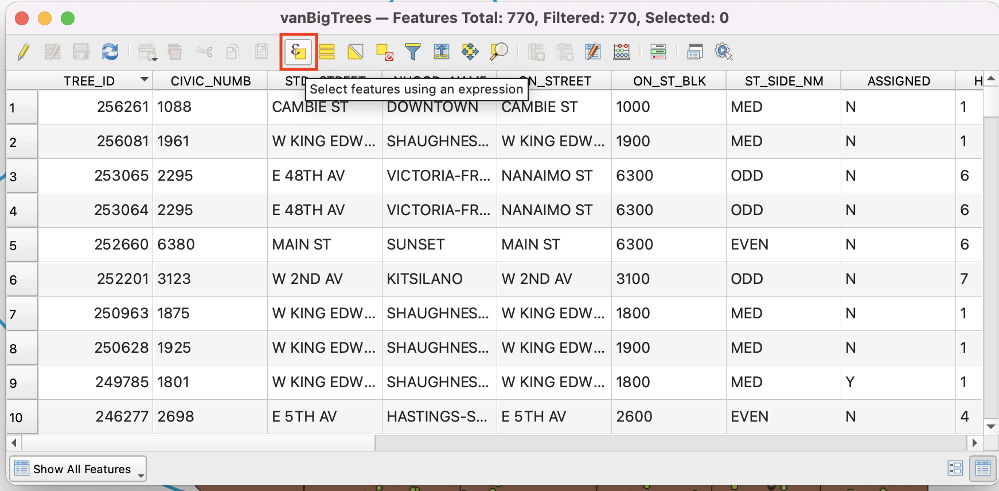
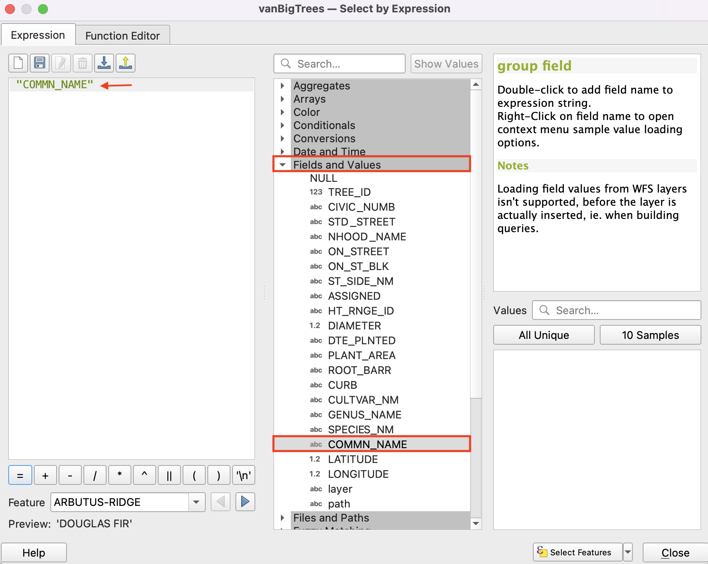
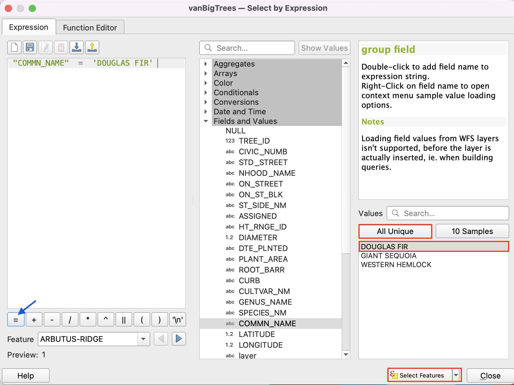
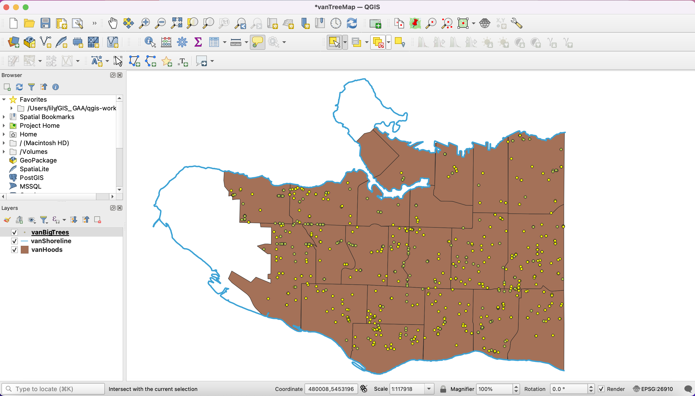
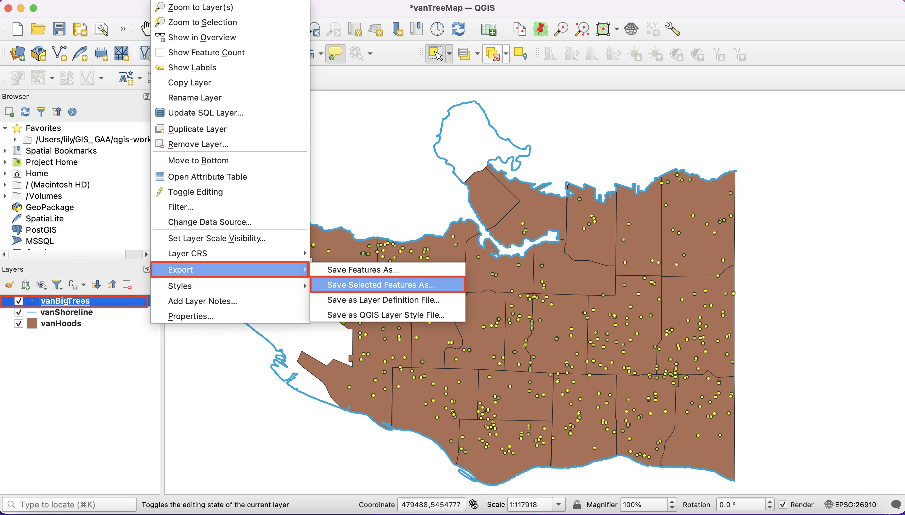
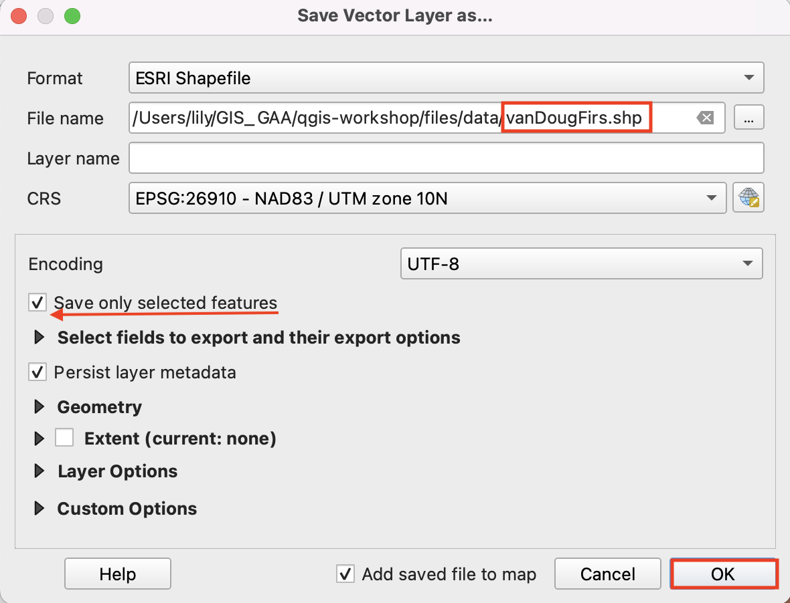
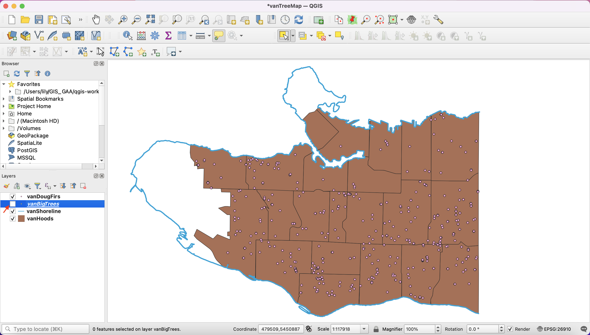

# Selecting Attributes

## Select only the Douglas Fir trees.
With your attribute table open, select the **Select features using an expression** button.

We will use this tool to query and select only features that have a common name value of "Douglas Fir".

In the middle of the window, expand the option for **Fields and Values**, and double-click **COMMN_NAME** so that it is entered in your expression builder (on the left).

Click the **=** button above the expression builder.

With COMMN_NAME selected, click the **All Unique** button. This displays all the unique values in the COMMN_NAME field. Double-click **DOUGLAS FIR**, then click the **Select features** button at the bottom right.
Close the expression builder window and close the attribute table.

*You should now see some trees selected on your map - they'll be yellow. These are the Douglas Fir trees*. 

## Create a new layer from your Douglas Fir tree selection.
Right-click your **vanBigTrees** layer in the Layers Panel, and select **Export** then **Save Selected Features As..**.

On the new window, choose:

**Format:** Esri Shapefile    
**File name:** navigate to the location of your project's data and save the file as **vanDougFirs**.

Notice that the option to save only selected features is enabled. Keep the rest of the default settings and click **OK**.

You will now see your new layer appear on your map.

In your Layers Panel, deselect the **vanBigTrees** layer to remove it from the display.

*You should now see Douglas Fir trees only*

