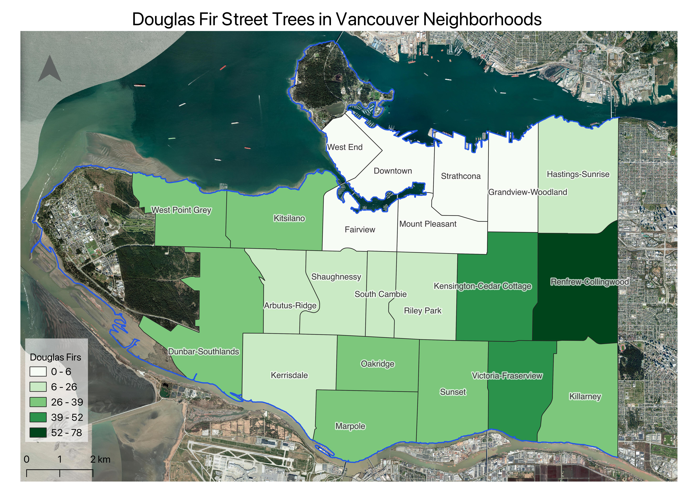

# Map Production with QGIS

This is an introductory workshop focusing on the fundamental concepts and skills needed to begin using **QGIS** to explore and analyze spatial data. The result of this project will be a choropleth map showing the number of Douglas Firs lining the streets in each of Vancouver's neighbourhoods. We will compose and export this map for print. By the end of the workshop participants will be able to:

- understand different types of geospatial data
- navigate the **QGIS 3.34 LTR** interface
- browse files and add data to a QGIS project
- query data from the attribute table 
- create a new shapefile
- edit the symbolization of spatial data 
- compose a map document for export
   
The final map you will create will look something like this:

*Note: While the workshop will be taught using the most recent QGIS Long Term Release (LTR), image documentation for the online workshop website references QGIS 3.22.7. Because the versions are only one release apart, differences between your screen and the workshop images should be minimal if any.*

---
#### GIS Resources at UBC:

- General Informational website for all things UBC GIS: [gis.ubc.ca](http://gis.ubc.ca/)
- UBC Library's guide for finding and working with GIS resources: [guides.library.ubc.ca/gis](http://guides.library.ubc.ca/gis)
- UBC's GIS Slack (create your own channel or lurk!): [ubcgis.slack.com](https://ubcgis.slack.com/)
- Archive of all [Research Commons workshops](https://ubc-library-rc.github.io/all.html)
- Contact UBC Library’s Geospatial team: `library.gis@ubc.ca`
- Schedule a 1:1 consult with the geospatial team [here](https://libcal.library.ubc.ca/appointments/research_commons#s-lc-public-pt)

    

This workshop was authored by Lily Demet and reviewed by Elizabeth Fernandes.

